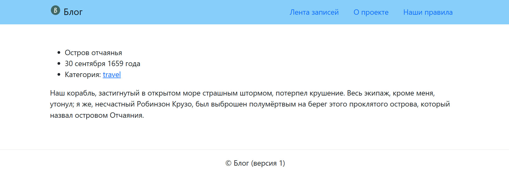

# project_blog_01

## Подготовка к выполнению задания:

1. Скачайте репозиторий django_homework1 на свой компьютер, в рабочую папку.
2. Разверните и активируйте виртуальное окружение в папке django_homework1, установите в виртуальное окружение зависимости из requirements.txt.
3. Создайте новый Django-проект project_blog_01.

### Должна получиться такая структура: 
Папка_со_всеми_вашими_проектами
└── django_homework1/
  ├── .vscode/    Служебная папка редактора кода (опционально, скрытая)
  ├── .git/       Служебная информация Git (скрытая)
  ├── html/       HTML-вёрстка для страниц и статика
  ├── tests/             Тесты, проверяющие проект
  ├── venv/              Виртуальное окружение
  ├── project_blog_01/   <--   Рабочая папка с вашим кодом проекта
  ├── .flake8            Настройки тестов   
  ├── .gitignore         Список файлов и папок, которые не отслеживает Git  
  ├── pytest.ini         Конфигурация тестов
  ├── README.md          Описание проекта 
  └── requirements.txt   Зависимости проекта

## Задание

1. Создайте и зарегистрируйте приложения: pages — это приложение понадобится для работы со статическими страницами проекта; blog — тут будет происходить вся работа с публикациями пользователей.
2. Опишите маршруты и напишите соответствующие view-функции согласно таблице:

3. Для каждого адреса установите namespaсe и name, совпадающие с именем приложения и view-функции соответственно. 
4. В файле views.py приложения blog разместите список posts. Каждый элемент этого списка — словарь, в котором хранится вся информация об отдельном посте. Информация из этого словаря должна будет выводиться на страницы проекта.

posts = [
    {
        'id': 0,
        'location': 'Остров отчаянья',
        'date': '30 сентября 1659 года',
        'category': 'travel',
        'text': '''Наш корабль, застигнутый в открытом море
                страшным штормом, потерпел крушение.
                Весь экипаж, кроме меня, утонул; я же,
                несчастный Робинзон Крузо, был выброшен
                полумёртвым на берег этого проклятого острова,
                который назвал островом Отчаяния.''',
    },
    {
        'id': 1,
        'location': 'Остров отчаянья',
        'date': '1 октября 1659 года',
        'category': 'not-my-day',
        'text': '''Проснувшись поутру, я увидел, что наш корабль сняло
                с мели приливом и пригнало гораздо ближе к берегу.
                Это подало мне надежду, что, когда ветер стихнет,
                мне удастся добраться до корабля и запастись едой и
                другими необходимыми вещами. Я немного приободрился,
                хотя печаль о погибших товарищах не покидала меня.
                Мне всё думалось, что, останься мы на корабле, мы
                непременно спаслись бы. Теперь из его обломков мы могли бы
                построить баркас, на котором и выбрались бы из этого
                гиблого места.''',
    },
    {
        'id': 2,
        'location': 'Остров отчаянья',
        'date': '25 октября 1659 года',
        'category': 'not-my-day',
        'text': '''Всю ночь и весь день шёл дождь и дул сильный
                порывистый ветер. 25 октября.  Корабль за ночь разбило
                в щепки; на том месте, где он стоял, торчат какие-то
                жалкие обломки,  да и те видны только во время отлива.
                Весь этот день я хлопотал  около вещей: укрывал и
                укутывал их, чтобы не испортились от дождя.''',
    },
]

5. Создайте шаблоны страниц и разместите их на уровне проекта. Вёрстку шаблонов сделайте на основе html-файлов, которые хранятся в директории html.

6. Подключите статику. В репозитории, в директории html, лежат папки со статикой: css и img. Сохраните статику на уровне проекта и подключите её к шаблонам.

### Вывод информации на страницы проекта

1. На главную страницу проекта выведите полный список публикаций из словаря posts. В директории html есть уже свёрстанная главная страница проекта: index.html. Переделайте её в Django-шаблон и сохраните в директории для шаблонов проекта.
2. Вёрстка отдельной страницы публикации подготовлена в файле html/detail.html. На эту страницу должен быть выведен полный текст поста.
3. На страницу категории ('category/<slug:category_slug>/') посты выводить пока что не надо; выведите на эти страницы лишь значение category_slug из адреса. Например, для адреса http://127.0.0.1:8000/category/personal/ выведите personal; текст на этой странице должен быть таким: «Публикации в категории personal».
4. Публикации должны передаваться в шаблоны в словаре контекста под ключом post. Не применяйте к дате публикации фильтр шаблонов date — это сейчас строка, а не объект даты. 
5. Шаблоны about.html и rules.html из директории html сохраните на уровне проекта и подключите к соответствующим view-функциям приложения pages.

### Вот так должен выглядеть в браузере результат вашей работы: 

## После выполнения задания: 
1. Запустите тесты локально, на компьютере. В активированном виртуальном окружении через терминал из папки: какие-то_ваши_папки/django_homework1 выполните команду pytest.
2. Проверить соответствие PEP8.
3. Если все тесты пройдены успешно, то можно сдавать проект.